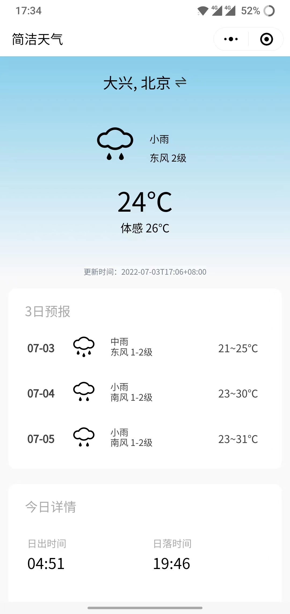

# Weather-Forecast-WeChat-Mini-Program

简单的天气预报微信小程序

## 截图

## 项目说明

天气数据来源于和风天气API，编译运行前需要自行申请和风天气的key。

和风天气开发平台：https://dev.qweather.com/

天气图标为开源的和风天气图标，详见：https://icons.qweather.com/

app.js中使用了微信云开发的云存储，用于存储天气图标，需要自行创建云环境并替换图片地址。

也可以使用自己的图床或用其他方式显示图片。

## Credit

项目的UI设计参考了以下两个项目，非常感谢：

WeatherHelper：https://github.com/tabalt/WeatherHelper

weather：https://github.com/Janthrven/weather
